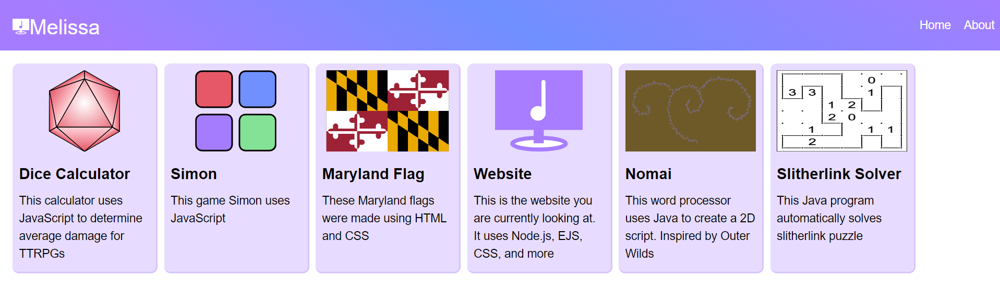
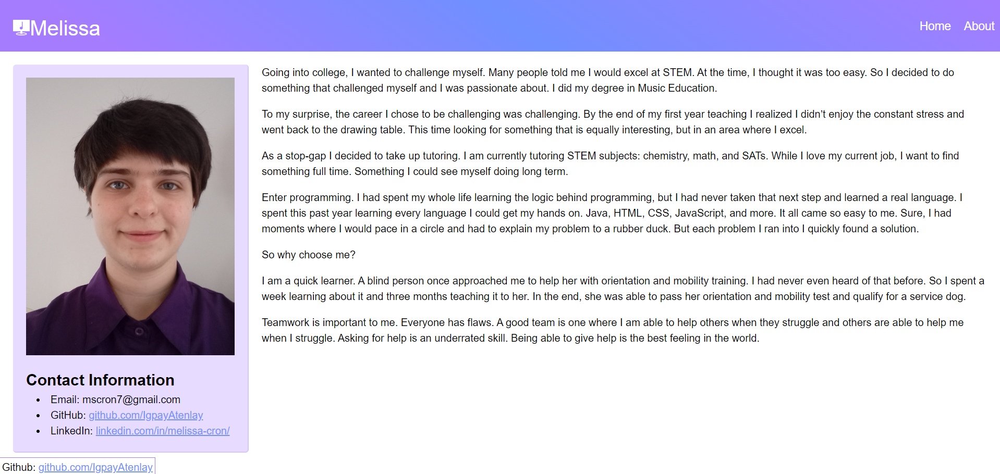

# Website

<a href="https:www.melissacron.com">www.melissacron.com</a>

## Description
This is a personal website to showcase coding projects I have made. It uses
HTML, CSS, Javascript, and React.

## Table of Contents
- [Nested Projects](#nested-projects)
- [Screenshots](#screenshots)
- [Code Examples](#code-examples)
- [To Do List](#to-do-list)

## Nested Projects

While the website itself is a project, there are many projects contained within. 
I have listed them below with links to each individual project's ReadMe file. 
For details on particular projects, please follow these links.

<ul>
    <li><a href="https://github.com/IgpayAtenlay/website/tree/main/client/src/pages/creatureCreator/README.md">Creature Creator</a></li>
    <li><a href="https://github.com/IgpayAtenlay/website/tree/main/client/src/pages/diceCalculator/README.md">Dice Calculator</a></li>
    <li><a href="https://github.com/IgpayAtenlay/website/tree/main/client/src/pages/simon/README.md">Simon</a></li>
    <li><a href="https://github.com/IgpayAtenlay/website/tree/main/client/src/pages/marylandFlag/README.md">Maryland Flag</a></li>
    <li><a href="https://github.com/IgpayAtenlay/NomaiWriting/blob/main/README.md">Nomai</a></li>
    <li><a href="https://github.com/IgpayAtenlay/Slitherlink/blob/main/README.md">Slitherlink Solver</a></li>
</ul>

## Screenshots
### Home Page:

### About Me Page:


## Code Examples
This CSS describes the colors which are used throughout the website
```agsl
    * {
        --background: white;
        --text: black;
        --tint-one: #e7dcff;
        --tint-two: #dce3ff;
        --tint-one-shadow: #d7c4ff;
        --tint-two-shadow: #c9d5ff;
        --shade-one: #A67CFF;
        --shade-two: #7090FF;
        --accent-one: #84E296;
        --accent-two: #E65768;
    }
```
This React code describes the cards that are found on the home page
```agsl
    export default function Card(props) {
        if (props.image) {
            return (<a class="card" href={props.url}>
                
                <h1>{props.title}</h1>
                <p>{props.description}</p>
            </a>);
        } else {
            return (<a class="card" href={props.url}>
                
                <h1>{props.title}</h1>
                <p>{props.description}</p>
            </a>);
        }
    }
```

## To Do List
- Add examples to Nomai and Slitherlink pages, or find way to integrate them into website
- Update the github links
- Create the ReadMe for Slitherlink project
- Figure out how to get Railway to automatically npm run build when deploying the website