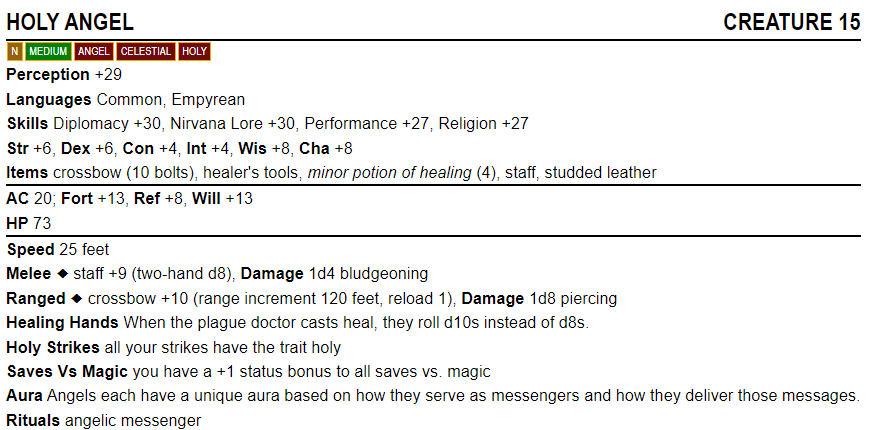
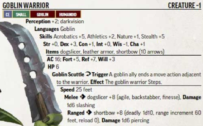

# Creature Creator

<a href="https:www.melissacron.com/creatureCreator">www.melissacron.com/creatureCreator</a>

## Description
This program uses React to immedietly create creature statblocks that look like they
were straight from a Pathfinder book. Either set the stats to "auto" and let the
program do all the work or manually input your values for more precise control.

One day I was trying to create a Pathfinder one-shot for my friends. I happened upon a
couple of creatures I liked, but I wanted to create another creature that would 
synergize well. Unfortunetly, that came with too many steps. Designing the creature,
balancing the creature, trying to make a pretty statblock for the creature. In the end,
I thought it would be fun to make a program that did all that for me.

## Table of Contents
- [Screenshots](#screenshots)
- [Code Examples](#code-examples)
- [To Do List](#to-do-list)

## Screenshots
### From My Website:

### From Pathfinder Book:


## Code Examples
This is the code for the dropdowns that change the ability scores for the creature. On 
change, it updates a local variable with the ability changed as well as any scores set 
to "auto". This update is then applied to the main variable "creature" which is in
the "CreatureContext"
```agsl
    function AbilityScore(props) {
        var {creature, setCreature} = useContext(CreatureContext);
        
        function handleChange(e) {
            var scale = e.target.value;
            var abilities = creature.abilities;

            abilities = {
                ...abilities,
                [e.target.id]: {
                    ...abilities[e.target.id],
                    scale: scale
                }
            }

            abilities = updateAbilities(abilities, creature.level);

            setCreature(prevCreature => ({
                ...prevCreature,
                abilities: abilities
            }));
        }

        return (
            <span>
                <label htmlFor={props.name}><b>{startCase(props.name)} </b></label>
                <select id={props.name} value={creature.abilities[props.name].scale} onChange={handleChange}>
                    <option value="auto">Auto</option>
                    <option value="manual">Manual</option>
                    <option value="extreme">Extreme</option>
                    <option value="high">High</option>
                    <option value="moderate">Moderate</option>
                    <option value="low">Low</option>
                    <option value="terrible">Terrible</option>
                </select>
            </span>
        );
    }
```
This is a compare function which sorts skills in alphabetically order, except for "lores" which are sorted alphabetically in the location where the word "lore" would be in the alphabet.
```agsl
    function compareFn(a, b) {
        if (a.name.includes("lore")) {
            // a is lore
            if (b.name.includes("lore")) {
                // b is lore
                // compare a and b alphabetically
                return a.name.localeCompare(b.name);
            } else {
                // b is not lore
                // compare lore and b alphabetically
                return "lore".localeCompare(b.name);
            }
        } else {
            // a is not lore
            if (b.name.includes("lore")) {
                // b is lore
                // compare a and lore alphabetically
                return a.name.localeCompare("lore");
            } else {
                // b is not lore
                // compare a and b alphabetically
                return a.name.localeCompare(b.name);
            }
        }
    }
```

## To Do List
- Make these editable
    - Name
    - Items
    - Weapons
    - Misc Abilities
- Change add blue color for alignment
- Move statblock to the side so it can be seen while editing