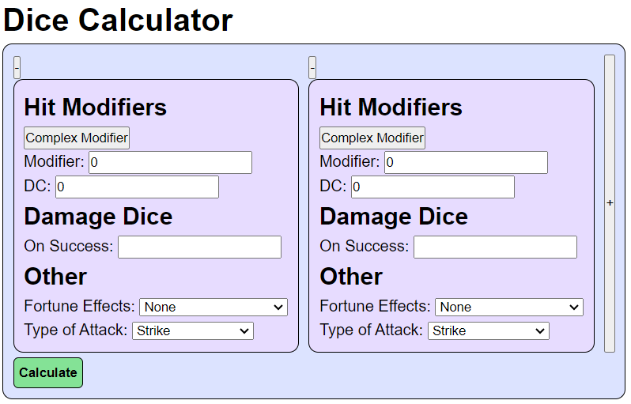
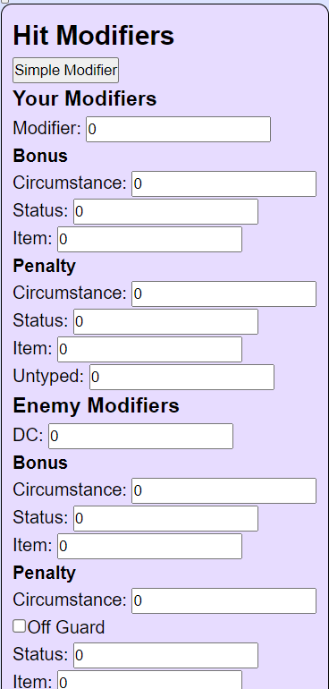

# Creature Creator

<a href="https:www.melissacron.com/diceCalculator">www.melissacron.com/diceCalculator</a>

## Description
This is a calculator that can be used to find average DPR and hit chance for a game that uses dice. It uses Pathfinder's four degrees of success to determine hit chance. The visuals of this project was created with React.js and the math is all done with JavaScript.

## Table of Contents
- [Screenshots](#screenshots)
- [Code Examples](#code-examples)
- [To Do List](#to-do-list)

## Screenshots
### Simple Dice Calculator:

### Complex Dice Calculator:


## Code Examples
The damage is inputed as a string format that is often used in TTRPGs (table top role playing games). This function takes that string and turns it into an array of dice that other functions use for easier calculations.
```agsl
    export default function parseDice(diceString = "") {
        var dice = {};
        if (diceString.length > 0) {
            var diceArray = diceString.split("+");
            diceArray.forEach(e => {
                e = e.trim();
                if (e.includes("d")) {
                var result = e.split("d");
                    if (dice[result[1]]) {
                        dice[result[1]] = dice[result[1]] + +result[0];
                    } else {
                        dice[result[1]] = +result[0];
                    }
                } else {
                    if (dice[1]) {
                        dice[1] = dice[1] + +e;
                    } else {
                        dice[1] = +e;
                    }
                }
            });
        }
        
        return dice;
    }
```
Calculating the accuracy of a hit takes a bit of time. When using a fortune effect it can take up to 400 calculations. As such, I only want it to happen once. This function checks the cache to see if this exact calculation has already been done. If not, it calls a different function to calculate and then cache the answer.
```agsl
    function getAccuracy(effectiveDC) {
        if (effectiveDC > 30) {
            effectiveDC = 30;
        } else if (effectiveDC < -9) {
            effectiveDC = -9;
        }

        if (!(effectiveDC in DCToAccuracyTable)) {
            calculateAccuracy(effectiveDC);
        }

        return {...DCToAccuracyTable[effectiveDC]};
    }
```

## To Do List
- Have average DPR for all activities combined
- Add instructions
- Have ability to have future activities dependent on the results of previous activities
- Shorten the length of 'Percent of Critical Successes: 15 %' to increase readability
- Improve CSS
- Test for screenreader capatibility
- Add an option to automatically hit
- Add ability to upgrade/downgrade degree of success
- Check copyright laws to see if disclaimer is needed at the bottom of the page