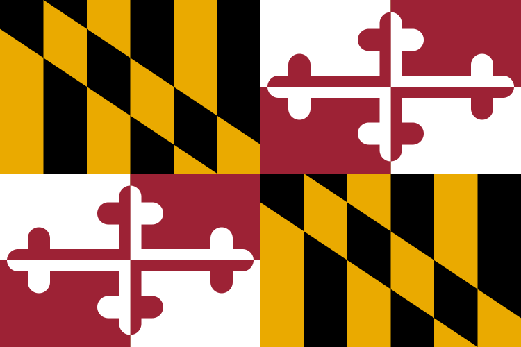

# Creature Creator

<a href="https:www.melissacron.com/marylandFlag">www.melissacron.com/marylandFlag</a>

## Description
I decided to create the Maryland flag using a variety of methods in order to practice 
using each method and comparing the end products. I like flag two the best due to the 
crisp and clean look, but using it without React to separate components would make the 
HTML incredibly messy. Check them all out and see which one you prefer!

<ul>
    <li>Flag One: HTML, CSS, absolute possitioning, and an absolute ton of divs</li>
    <li>Flag Two: HTML, CSS, and CSS Grid</li>
    <li>Flag Three: HTML Canvas and Javascript</li>
</ul>

## Table of Contents
- [Screenshots](#screenshots)
- [Code Examples](#code-examples)
- [To Do List](#to-do-list)

## Screenshots
### Maryland Flag:


## Code Examples
Both flag one and two share the method for making the diagonal in the yellow/black section. They use CSS to create a linear-gradient with overlapping areas to make a sharp line at an angle. This is the code for flag two.
```agsl
    /*black and yellow boxes*/
    .gridFlag .black-and-yellow {
        display: grid;
        grid-template-columns: repeat(6, 1fr);
    }
    .gridFlag .one {
        background: linear-gradient(35deg, yellow 75%, black 0%);
    }
    .gridFlag .two {
        background: linear-gradient(35deg, black 60%, yellow 0% 85%, black 0%);
    }
    .gridFlag .three {
        background: linear-gradient(35deg, yellow 45%, black 0% 70%, yellow 0%);
    }
    .gridFlag .four {
        background: linear-gradient(35deg, black 30%, yellow 0% 55%, black 0%);
    }
    .gridFlag .five {
        background: linear-gradient(35deg, yellow 15%, black 0% 40%, yellow 0%);
    }
    .gridFlag .six {
        background: linear-gradient(35deg, yellow 25%, black 0%);
    }
```
This is the code for creating the flower pattern in each quadrent of the white/red area. It is called several times to account for all the different starting locations and orientations. In addition, it contains a scale variable which allows the flag to be different sizes.
```agsl
    function flower(x,y,xInverse,yInverse, scale) {
      var xScale = 12 * scale * xInverse;
      var yScale = 8 * scale * yInverse;
      var counterClockwise = xInverse*yInverse === -1;
      context.beginPath();
      context.moveTo(x, y);
      context.lineTo(x + width/xScale*11, y);
      context.ellipse(x + width/xScale*10, y, width/xScale*xInverse, height/yScale*yInverse, 0, Math.PI/2 - Math.PI/2*xInverse, Math.PI - Math.PI/2*yInverse, counterClockwise);
      context.lineTo(x + width/xScale*9, y + height/yScale);
      context.lineTo(x + width/xScale*9, y + height/yScale*2);
      context.ellipse(x + width/xScale*8, y + height/yScale*2, width/xScale*xInverse, height/yScale*yInverse, 0, Math.PI/2 - Math.PI/2*xInverse, Math.PI/2 + Math.PI/2*xInverse, counterClockwise);
      context.lineTo(x + width/xScale*7, y + height/yScale);
      context.lineTo(x + width/xScale, y + height/yScale);
      context.lineTo(x + width/xScale, y + height/yScale*3);
      context.lineTo(x + width/xScale*2, y + height/yScale*3);
      context.ellipse(x + width/xScale*2, y + height/yScale*4, width/xScale*xInverse, height/yScale*yInverse, 0, Math.PI/2 + Math.PI/2*xInverse, Math.PI - Math.PI/2*yInverse, counterClockwise);
      context.lineTo(x + width/xScale, y + height/yScale*5);
      context.lineTo(x + width/xScale, y + height/yScale*6);
      context.ellipse(x, y + height/yScale*6, width/xScale*xInverse, height/yScale*yInverse, 0, Math.PI/2 - Math.PI/2*xInverse, Math.PI - Math.PI/2*yInverse, counterClockwise);
      context.fill();
    }
```

## To Do List
- Figure out a new method to make a Maryland Flag using coding
- Learn how to create inline SVG images?