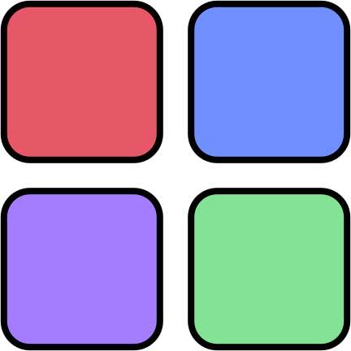

# Creature Creator

<a href="https:www.melissacron.com/simon">www.melissacron.com/simon</a>

## Description
If you are unfamiliar with the game simon, it is a memory game. The game
gives you a pattern of colors and you have to repeat it back. This version
uses JavaScript and JQuery to impliment the interactivity.

## Table of Contents
- [Screenshots](#screenshots)
- [Code Examples](#code-examples)
- [To Do List](#to-do-list)

## Screenshots
### My Simon:

### Origional Game:


## Code Examples
The HTML for this game is quite simple. The aria-label is for screenreader 
accessability and is the button equivalent of having alt text for an image.
Since the buttons have no text or image, we use the aria-label to describe
the sound the buttons make so people with screenreaders can know which button
to press. The are purposefully extremely short to not interfere with the
gameplay.
```agsl
    <div className="simon">
        <h1>Click any button to start</h1>

        <div class="container">
        <button id="one" aria-label="lowest"></button>
        <button id="two" aria-label="low"></button>
        <button id="three" aria-label="high"></button>
        <button id="four" aria-label="highest"></button>
        </div>
    </div>
```
This Javascript code both chooses what audio to play and creates the button flash.
```agsl
    function animatePress(button) {
        switch(button) {
            case "one":
                colorAudio[0].play();
                break;
            case "two":
                colorAudio[1].play();
                break;
            case "three":
                colorAudio[2].play();
                break;
            case "four":
                colorAudio[3].play();
                break;
        }
        $("#" + button).fadeOut(100).fadeIn(100);
    }
```

## To Do List
- Add instructions